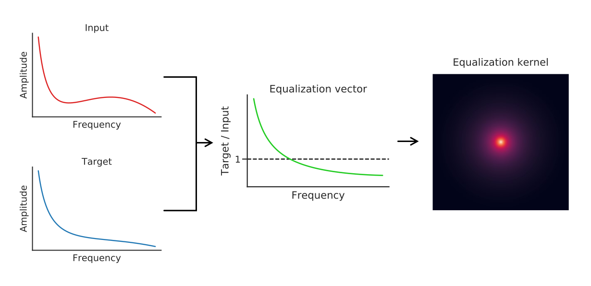

# CryoET Spectrum Matcher

A tool to normalize CryoET data by matching amplitude spectrums.

The tool works by extracting the radially averaged amplitude spectrum from a reference tomogram to use as a target for other tomograms. To match another tomogram to the reference, the target spectrum is divided by the tomogram's amplitude spectrum, resulting in a vector of frequency-wise equalization factors. The equalization vector is then turned into a rotationally symmetric kernel, which is then applied to the tomogram in fourier space.




## Installation
- Install [Miniconda3](https://docs.conda.io/en/latest/miniconda.html)
- Clone the git repo
- Create a new conda environment and activate it
```bash
    $ conda env create -f requirements.yaml
    $ conda activate tsm
```
- Done!
 
## Usage

The tool consists of two main components: 
- Extraction of a tomogram's radially averaged amplitude spectrum
- Applying an extracted spectrum to other tomograms

### Extracting an amplitude spectrum
To extract a tomogram's amplitude spectrum:  
```bash 
$ python extract_spectrum.py --input <input_tomo.mrc> --output <amp_spectrum.tsv>
```

### Match a tomogram to an extracted spectrum
To apply an extracted amplitude spectrum to another tomogram:  
```bash
$ python match_spectrum.py --input <imput_tomo.mrc> --target <amp_spectrum.tsv> --output <filtered_tomo.mrc>
```